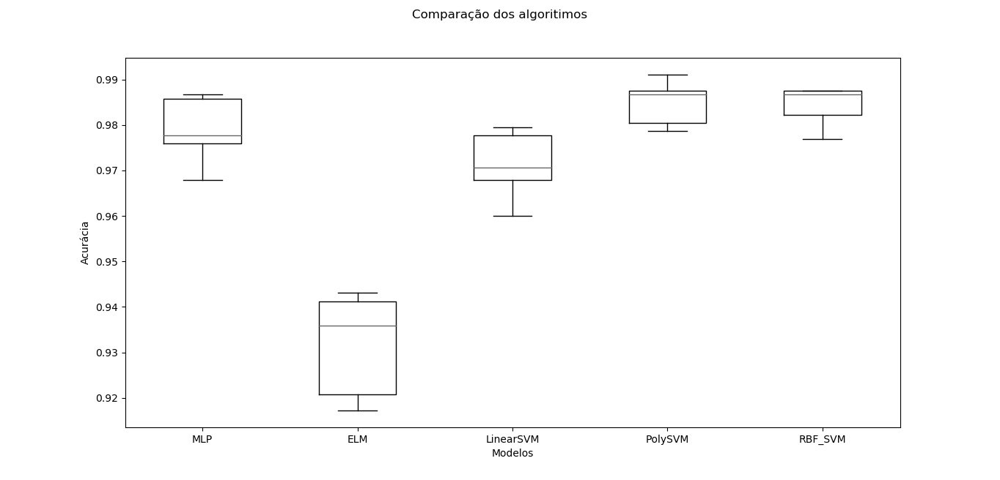

# Descrição

Um estudo comparativo do algoritmo Support Vector Machine (SVM).

# Problema

O problema escolhido é de multi-classificação, reconhecimento de
dígitos manuscritos. Ou seja, são 10 classes.

A resolução do dataset mais simples escolhido é de 8x8, portanto 64
_features_. A seguir uma amostra do dataset:


# Benchmark

Foi avaliado os algoritmos:

+ SVM Classifier Linear Kernel
+ SVM Classifier Polynomial Kernel
+ SVM Classifier RBF Kernel
+ Multi-Layer Perceptron (MLP)
+ Extreme Learning Machine (ELM) -- in-progress
+ RBF Neural Network (RBF_NN) -- in-progress



# Replicação dos resultados

Instale o interpretador de linguagem [Python3]. Então através do
gerenciador de pacotes [pip]:

``` shell
pip install -r requirements.txt
python run.py
```

[Python3]: www.python.org
[pip]: https://pip.pypa.io/en/stable/installing/

# License
MIT
